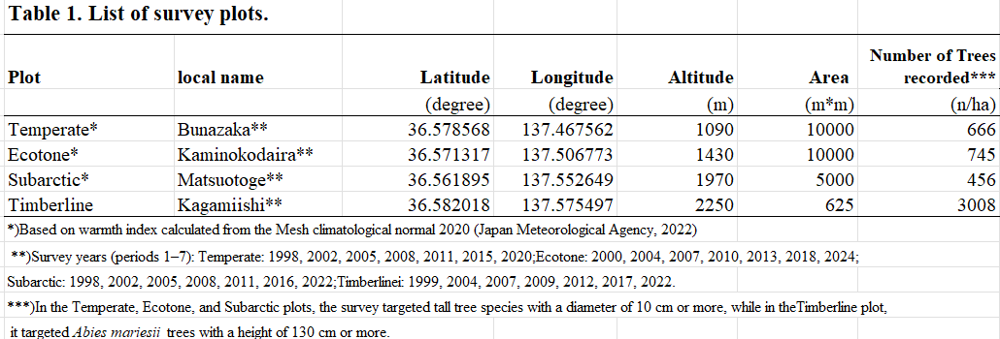
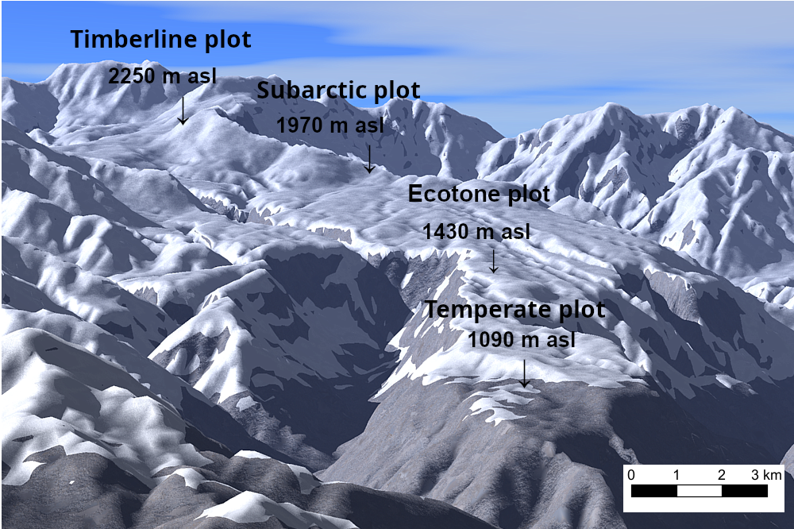
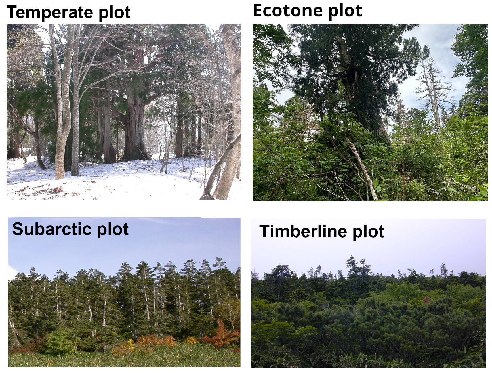
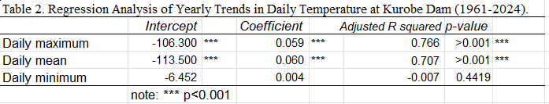
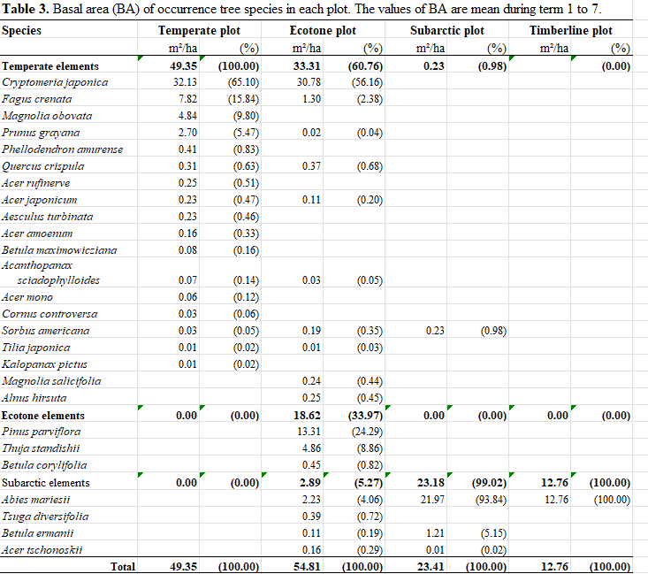
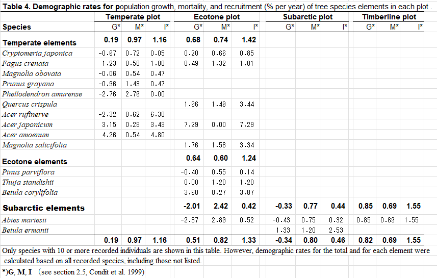

---
title: "TateyamaForestZoneShift"
output:
  html_document:
    toc: true
    toc_float:
      collapsed: false
      smooth_scroll: true
    toc_depth: 4
    df_print: paged
---


```{r, message = FALSE, warning = FALSE}
library(package="TateyamaForest")
library(kableExtra)
library(ggplot2)
library(patchwork)
#help(package="TateyamaForest")
#data(package="TateyamaForest")

```
# Data set for Kurobe dam temperature (1965-2024)
```{r}
#Fig_year_WI_3()
dd<-kurobe_1965_2024
dd_plot<-function(dd=dd){
  plot(dd$date,dd$max,type="l",col="red",ylim=c(-10,25),
       xlab="year",ylab="Temperature at Kurobe dam")
  lines(dd$date,dd$min,col="blue")
  lines(dd$date,dd$mean,col="green")
}
dd_plot(dd)

(.<-kurobe_dam_temperature)

#Fig_kurobe_dam_temperature()
```
# Data set for forest dynamics


```{r}
  s <- new_statistics(
    wi_year          = wi_year,
    Abies_death_ratio = Abies_death_ratio,
    f1_raw           = .data_Fig_yr_ba_kaminokodaira_Cryptomeria_Fagus_Abies_2024,
    f2_raw           = .data_Fig_yr_ba_kaminokodaira_zone_2024
  )

  print(s)
```


# TABLE 1 | Descriptions of the survey plots.



# FIGURE 1 |  Bird’s-eye view of each plot.


# FIGURE 2 | Photographs of the forest type in each plot. 


# FIGURE 3 | Changes in temperature at the Kurobe Dam.
```{r}
Fig_kurobe_dam_temperature()
```


# TABLE 2 | The results of regression analyses of yearly trends in daily temperature at the Kurobe Dam (1965–2024).



# FIGURE 4 | Changes in WI for each plot over time.

```{r}
TateyamaForest::Fig_year_WI_3()

```

## Mann-Kendall test

```{r}
data(wi_year)
  d<-c()
for (i in plt6$na){
  yr=wi_year$year
  d<-c(d,list(MannKendall_lm(yr,wi_year[,i])))
}
names(d)<-plt6$na
d

```
### warming and forest zone

```{r}
d<-subset(wi_year,year>1993)
yr.<-d$yr.
wi.<-d$Kaminokodaira
ratio_wi55up<-100*sum(wi.>55)/length(wi.)
 paste0("Ecotone plot crossed the ecotone–temperate boundary (WI = 55 °C·month) for the first time in 1994. In the period 2013–2024, ",round(ratio_wi55up,1),",% of years exceeded WI = 55")


```


# TABLE 3 | Basal areasof each tree species in each plot. 



# TABLE 4 | Demographic rates for population rates in each plot.




# FIGURE 5 | Changes in the total basal area in each plot over time.
```{r}
Fig_yr_ba_site2()
```


# FIGURE 6 | Changes in basal area in the Ecotone plot over time. 
```{r}
Fig_yr_ba_Kaminoko_JVS2()

```


# FIGURE 7 | Relationships between the warmth index (WI) and the basal area ratio at the Ecotone plot. 
```{r}
res<-Fig_wi_ba_cor_ancova_JVS2()
res
```

# TABLE 5 | Analysis of covariance (ANCOVA) results for the relationship between the warmth index and basal area ratio in the Ecotone plot.


## ANCOVA: BAratio ~ WI * species/zone

```{r}
res4 <- statistics_ANCOVA_wi_ba_EcotonePlot(s)
res4$by_species$slopes
```

# FIGURE 8 | Distributions of the diameter at breast height of _A. mariesii_ during the first survey (2000) in each plot.

```{r}
Fig_Abies_DBH_hist_JVS2()
```


# FIGURE 9 | Changes in the cumulative ratio of dead standing _A. mariesii_ trees in the Ecotone plot in 2000 and the estimated frequency of death.

```{r}


Fig12_revised ()

```


# FIGURE 10 | Changes in cumulative mortality ratio of _Abies mariesii_ in each survey plot over time.

```{r}


Fig_Abies_death_ratio()

res1 <- statistics_cor_WI_AbiesCumulativeMortality(s)
res1
```

## ANCOVA: cumulative mortality ratio ~ year * plot

```{r}


res2 <- statistics_ANCOVA_Abies_CumulativeDeathRatio_year_plot(s)
res2$pairwise
```


# FIGURE 11 | Relationships between the warmth index (WI) and (a) basal area ratio and (b) cumulative mortality ratio of _Abies mariesii_ in the Timberline, Subarctic, and Ecotone plots. 

```{r}
TemperatureWIAbies_Population_BA_Mortality

res <- Fig_Abies_wi_ba_mortality()
res
```


# Appendix FIGUER S1 | Changes in the maximum snow depth for each plot over time.

```{r}
Fig_snow_depth()
```

# Appendix FIGUER S2 | Changes in the annual snow cover duration (days) for each plot over time.

```{r}
Fig_snow_cover()
```

# Appendix  TABLE S3 | Pearson correlation coefficients between climate variables and demographic rates(Condit et al.) of _A. mariesii_.


```{r}


tbl <- Table_TemperatureWIAbiesPopulation_cor()

knitr::kable(tbl) |>
  kableExtra::kable_styling(
    bootstrap_options = c("striped", "condensed"),
    font_size = 11,
    full_width = TRUE
  ) |>
  kableExtra::scroll_box(width = "100%")

```


