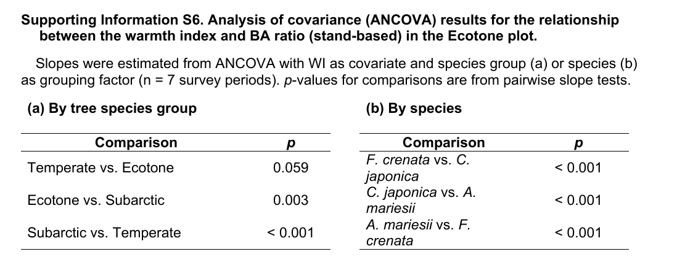
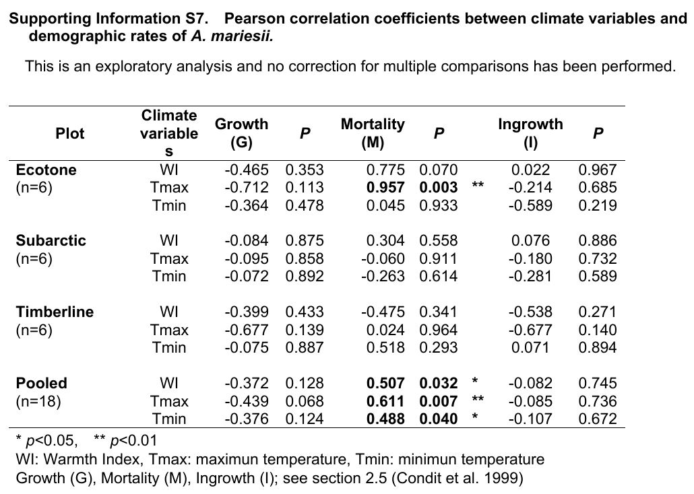

# mail

Dear Jayalakshmi,

Thank you very much for your help with the production of our article.

Article ID: JVS_70175
Article DOI: 10.1111/JVS.70175
Manuscript Reference ID: 5217335

During proof checking, we found an error in the elevation of the meteorological observation site. The paper states 1,368 m, but the correct figure is 1,459 m. We do not expect the main conclusions to change, but several results derived from this value, including the warmth index, will need to be revised.

Because these revisions go beyond typical proof corrections, we are unlikely to meet today's 6:00 PM (JST) deadline. We would therefore like to ask you to put the proof on hold. If necessary, we would be grateful if you could consult the handling editor on whether the revised results require editorial review before publication.

We are working urgently on the revisions and will send the corrected text, together with the other proof corrections from the co-authors, as soon as possible. We apologize for the inconvenience.

Best regards,

Megumi Ishida
28 September 2026

# correct Branch "alt_correct"

```{r, message=FALSE}
system("git branch --show-current", intern = TRUE)
#library(package="TateyamaForest")
devtools::load_all("../../..")
```

# csv
[*] YearsIntervalCalc_plots_temp.csv    (alt_correct.R)

# RData

## wi RData

```{r, message=FALSE}
fl<-read.csv("../old_RData.csv")
fl
knitr::kable(fl) 
```

# Manuscript 

## 1368m.png


### response OK!! 5.docx

## eq1


### response OK!! 5.docx

## Fig04.png


### response

```{r}
res<-Fig_year_WI_3()
res

```


## WI-increased.png


### response todo

## Fig7.png


```{r}
 # .data_Fig_yr_ba_kaminokodaira_zone_2024
 # .data_Fig_yr_ba_kaminokodaira_Cryptomeria_Fagus_Abies_2024
  
res<-Fig_wi_ba_cor_ancova_JVS2()
res
```


## WI-regression.png


## WI-ANCOVA


## WItrend3


## 3-1-change in WI


## EcotonePlot-WI


## WItrend


## Fig11


```{r,fig.height=12}
Abies
res <- Fig_Abies_wi_ba_mortality()
res

```


## WItrend2


## S6


```{r}
  s <- new_statistics(
    wi_year          = wi_year,
    Abies_death_ratio = Abies_death_ratio,
    f1_raw           = data_Fig_yr_ba_kaminokodaira_Cryptomeria_Fagus_Abies_2024,
    f2_raw           = data_Fig_yr_ba_kaminokodaira_zone_2024
  )

  print(s)
```


## ANCOVA: BAratio ~ WI * species/zone

```{r}
res4 <- statistics_ANCOVA_wi_ba_EcotonePlot(s)
res4$by_species$slopes
```

## ANCOVA: cumulative mortality ratio ~ year * plot

```{r}


res2 <- statistics_ANCOVA_Abies_CumulativeDeathRatio_year_plot(s)
res2$pairwise
```

## S7



```{r}


tbl <- Table_TemperatureWIAbiesPopulation_cor()

knitr::kable(tbl) |>
  kableExtra::kable_styling(
    bootstrap_options = c("striped", "condensed"),
    font_size = 11,
    full_width = TRUE
  ) |>
  kableExtra::scroll_box(width = "100%")

```


## zendo.png


