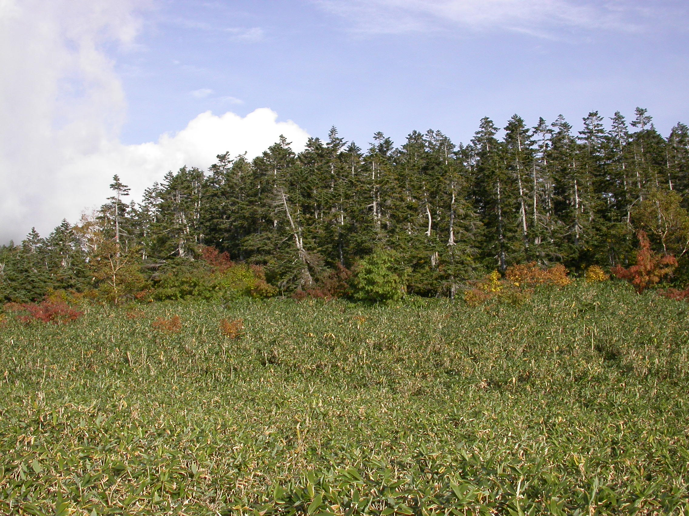
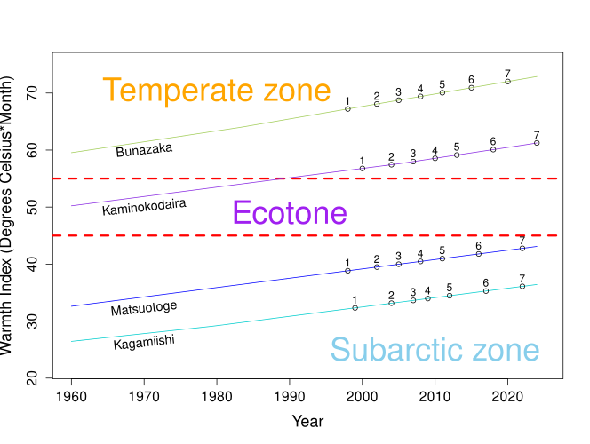
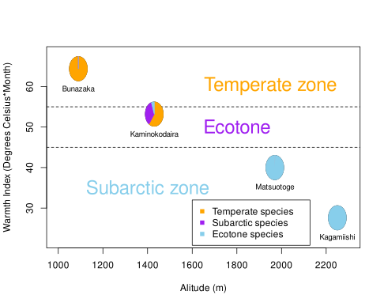

We investigated the relationship between forest dynamics and global warming from 1998 to the present, 2024, in Bunasaka (1,090m above sea level, temperate, Japanese cedar-beech forest), Kaminokodaira (1,430m above sea level, transition zone, Japanese cedar-Japanese pine-beech-Maries' fir forest), Matsuo-toge (1,970m above sea level, subarctic, Maries' fir forest), and Kagamiishi (2,250m above sea level, tree line, Pinus pumila-Maries' fir forest) in the Northern Alps of Chubu Sangaku National Park. The total basal area at breast height of the forest stands increased over time during the survey period in all survey areas. Focusing on the growth of basal area at breast height of the constituent species, in the Kaminokodaira survey area, where temperate and subarctic tree species are mixed, temperate species increased, whereas subarctic species decreased. In particular, many dead trees were observed at all diameter levels for M. mariesii at the start of the survey, and the mortality rate of surviving individuals at that time 
reached50% during the survey period. When calculating by default using the Climate Value Mesh File 2000 (reference year 1987), Kami-Odaira is within the 54°C/month transition zone, but if we assume that the temperature rise at Kurobe Dam was similar in each survey area, it is estimated that it exceeded 55°C/month in the late 1980s and was already in the temperate zone at the time of the survey. Given the large number of dead trees at Kami-Odaira at the start of the survey for M. mariesii, the high mortality rate of surviving M. mariesii, and the increased growth of temperate elements, it can be said that the possibility of the forest zone being raised by global warming cannot be denied.

中部山岳国立公園北アルプス立山のブナ坂(標高1090m　温帯、スギ−ブナ林)、上ノ小平(標高1430m　移行帯スギ−キタゴヨウ−ブナ−オオシラビソ)、松尾峠(標高1970m　亜寒帯　オオシラビソ林)、鏡石(標高2250m　森林限界、ハイマツ−オオシラビソ)の1998年から現在2024年に至るまでの森林動態と温暖化の関連について検討した。林分の胸高断面積合計はいずれの調査区も調査期間中、時間の経過とともに増加していた。構成種群の胸高断面積成長に着目すると温帯と亜寒帯の樹種が混交する上ノ小平調査区では、温帯要素の樹種で増加していたのに対し、亜寒帯要素の樹種では減少していた。特にオオシラビソでは調査開始時点で全直径階で立枯木が多く観察され、当時の生残個体も調査期間中の枯死率が5割に達した。気候値メッシュファイル2000(基準年1987年)をデフォルトで計算すると上の小平は54℃・月 移行帯の範囲内であるが、黒部ダムの温度上昇が各調査区で同様であったと仮定 すると1980年代後半で55℃・月を超え調査時点で、すでに温帯域であったと推定された。 
上の小平でのオオシラビソの調査開始時期の立枯木の多さや、生き残ったオオシラビソの死亡率 の高さ、温帯要素の成長量の増加から、温暖化によって森林帯が上昇している可能性は否定でき ないといえた。

**Abstruct **

**Key words** :  _Grobal warming, Warmth index, Northan Alps, Forest zone, ecotone, longterm monitoring_ 

## Study site

We surveyed on the lava plateau of Mt. Tateyama in the Northern Alps of Chubu Sangaku National Park (Figure 1).

<table class="table" style="font-size: 10px; margin-left: auto; margin-right: auto;">
<caption style="font-size: initial !important;">List of survey plots</caption>
 <thead>
  <tr>
   <th style="text-align:left;">  </th>
   <th style="text-align:left;"> na </th>
   <th style="text-align:right;"> ido </th>
   <th style="text-align:right;"> kei </th>
   <th style="text-align:right;"> alt </th>
   <th style="text-align:right;"> Area </th>
  </tr>
 </thead>
<tbody>
  <tr>
   <td style="text-align:left;"> 2 </td>
   <td style="text-align:left;"> Bunazaka </td>
   <td style="text-align:right;"> 36.57857 </td>
   <td style="text-align:right;"> 137.4676 </td>
   <td style="text-align:right;"> 1090 </td>
   <td style="text-align:right;"> 10000 </td>
  </tr>
  <tr>
   <td style="text-align:left;"> 4 </td>
   <td style="text-align:left;"> Kaminokodaira </td>
   <td style="text-align:right;"> 36.57132 </td>
   <td style="text-align:right;"> 137.5068 </td>
   <td style="text-align:right;"> 1430 </td>
   <td style="text-align:right;"> 10000 </td>
  </tr>
  <tr>
   <td style="text-align:left;"> 5 </td>
   <td style="text-align:left;"> Matsuotoge </td>
   <td style="text-align:right;"> 36.56189 </td>
   <td style="text-align:right;"> 137.5526 </td>
   <td style="text-align:right;"> 1970 </td>
   <td style="text-align:right;"> 5000 </td>
  </tr>
  <tr>
   <td style="text-align:left;"> 7 </td>
   <td style="text-align:left;"> Kagamiishi </td>
   <td style="text-align:right;"> 36.58202 </td>
   <td style="text-align:right;"> 137.5755 </td>
   <td style="text-align:right;"> 2250 </td>
   <td style="text-align:right;"> 625 </td>
  </tr>
</tbody>
</table>

**Figure 1.** A bird's-eye view showing the locations of Bunazaka (temperate, cedar-beech forest), Kaminokodaira (transition zone, cedar-Japanese pine-beech-Maries fir forest), Matsuo Toge (subarctic, Maries fir forest), and Kagamiishi (tree line, dwarf pine-Maries fir forest) on the lava plateau of Mt. Tateyama in the Northern Alps of Chubu Sangaku National Park.

図.3　関西電力黒部ダムにおける気温(日最高、日最低、日平均)の経年変化.毎朝9時時点の最低、最高、最低最高平均値から算出した値の集計。

**Figure.3 **  Changes in temperature (daily maximum, daily minimum, daily average) at Kansai Electric Power Kurobe Dam over time. Values calculated from the minimum, maximum, and average minimum and maximum values as of 9:00 a.m. each morning.

図.4　関西電力黒部ダムにおける西暦年と気温(日最高、日最低、日平均)の回帰分析結果

図.5　各調査区における温量指数の経年変化。気候値メッシュファイルと黒部ダム気温計測値の回帰式(表)から推定。

**Figure.5 **  Changes in the warmth index over time for each survey area. Estimated from a regression equation (Table) of the climate mesh file and Kurobe Dam temperature measurements.

## Field survey

 Forest tree surveys were conducted seven times in each plot from 1999 to 2024.All stems exceeding 10 cm in diameter at breast height (DBH) were identified with numbered aluminum tags, which were fixed at breast height using nails and wires, and DBH was measured to the nearest 0.1 cm at the height of the tags. The three-dimensional coordinates of the numbered tags for each tree and of the location of the bus road were also surveyed with a total station (TCR307, Leica Geosystems, AG) and laser range finder (TruPulse360, LaserTechnology Inc.). Since the 2007 survey, we have visually evaluated VT for each tree (Table 1). VT has been reported to be a powerful descriptor of diameter growth (Nakajima et al., 2011).

## Analysis

###　各調査区の温量指数の経年変化の推定

　各調査区の月別平均気温、温量指数は気候値メッシュファイル2000(気象庁、[@ishida1991toyama_meteological_data])によって算出した。

　気温低減率は0.55℃/100m　　とした0.55/100m (IV, 21p Nakajima 　[@toyama_prefecture_tateyama_report_2020])

　
　黒部ダムにおける平均気温の経年変化を推定する関数は以下とした。
  
  F_kurobe_dum_mean_tmp <-function(year) -47.932410 +   0.027340 *year

　基準年を0とし各年の年平均気温の差分を計算した。
　
　F_kurobe_dum_mean_tmp_diff <- function(year)

　F_kurobe_dum_mean_tmp(year)-F_kurobe_dum_mean_tmp(1987)

　温量指数の計算の際には、その差分を加えた。

　 δT=F_kurobe_dum_mean_tmp_diff(year)
　
　⊿T=Ti-5 + δT ただし⊿T<0　のとき⊿T=0　(Tiは月別平均気温)

　wi=∑⊿T

  提供いただいたデータが年ごとのデータであった。
  年平均気温に対する差分は各月の差分と等しいものとして計算し、
  月別の気温変化の経年変化の傾向は考慮されていない。

# Results
## Tree Species and Forest Construction 

図.6　各調査区の温量指数と構成樹種割合。温量指数は気候値メッシュファイル2000から推定した。構成樹種については表 species_list 参照。

**Figure.6 **  Warmth index and proportion of tree species in each survey area. The warmth index was estimated from the climate value mesh file 2000. For the constituent tree species, see the species_list table.

## Forest Growth

図.7　各調査区の胸高断面積合計の経年変化率。胸高断面積合計変化率は期首の胸高断面積合計を除して算出。

**Figure.6 **  Rate of change over time in the total basal area at breast height for each survey area. The rate of change in the total basal area at breast height is calculated by dividing the total basal area at breast height at the beginning of the period.

図.8　上の小平調査区における種群別の胸高断面積合計の経年変化率。胸高断面積合計変化率は期首の胸高断面積合計を除して算出。種軍に関しては表　species_list 参照。

**Figure.8 **  Annual change rate of total basal area at breast height by species group in the Kodaira survey area above. The total basal area change rate is calculated by dividing the total basal area at breast height at the beginning of the period. For species groups, see Table species_list.

図.9　上の小平調査区におけるブナ(温帯要素)とオオシラビソ(亜寒帯要素)の胸高断面積合計の経年変化率。胸高断面積合計変化率は期首の胸高断面積合計を除して算出。

**Figure.9 **  The annual rate of change in the total basal area at breast height of _Fagus crenata_ (temperate element) and _Abies mariesii_ (subarctic element) in the Kaminokodaira survey area. The rate of change in the total basal area at breast height was calculated by dividing the total basal area at breast height at the beginning of the period.

## Abies mariesii 

図.10　各調査区の期首調査時におけるオオシラビソの胸高直径分布。生存木(白抜き)と立枯木(斜線:は期末調査時に成立,黒ぬき:倒伏)を合わせて表示している。

**Figure.10 **  Distribution of diameter at breast height of _Abies mariesii_ at the time of the first survey in each survey area. Shown are both surviving trees (white) and dead trees (diagonal lines: established at the time of the final survey, black lines: fallen).

図.12　各調査区のオオシラビソの積算枯死率の比較。胸高直径の小さい個体から積算。

**Figure.12 **  Comparison of cumulative mortality rates of Abies mariesii in each survey area. Calculated starting from individuals with smallest diameter at breast height.

# Discussion

# Acknowledgement

# References

 

